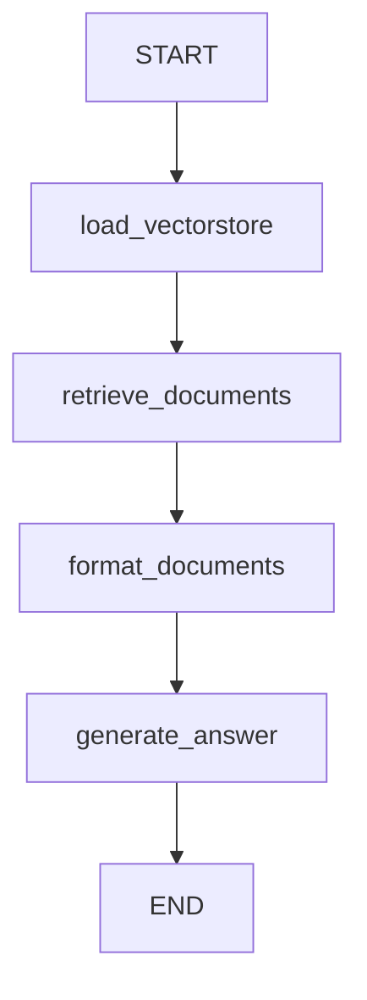

# 🧠 Simple GraphRAG com LangGraph e LangChain

Este projeto demonstra uma implementação simples e modular de um pipeline GraphRAG utilizando [LangChain](https://www.langchain.com/) e [LangGraph](https://github.com/langchain-ai/langgraph), integrando PDF loader, FAISS e LLM local compatível com OpenAI.

---

## 📦 Estrutura de Pastas

```
.
├── classic_rag.py          # Classe para carregar PDFs e construir vetor FAISS
├── graph_definition.py     # Orquestração dos nós via LangGraph
├── graph_nodes.py          # Funções dos nós do grafo
├── llm_model.py            # Instancia modelo LLM local (ex: LM Studio)
├── main.py                 # Executa o pipeline
├── state_agent.py          # Schema do estado compartilhado entre os nós
└── documentos/             # (opcional) PDFs usados como fonte de dados
```

---

## 🔄 Pipeline (GraphRAG)



### Componentes do Pipeline:

| Etapa               | Função Técnica                                                                 |
|---------------------|--------------------------------------------------------------------------------|
| `load_vectorstore`  | Cria ou carrega um FAISS index e retorna um retriever                          |
| `retrieve_documents`| Consulta documentos relevantes via retriever (`invoke(query)`)                 |
| `format_documents`  | Formata os metadados e conteúdo dos documentos recuperados                     |
| `generate_answer`   | Injeta contexto em um prompt e utiliza o LLM para gerar a resposta final       |

---

## 🚀 Execução

### 1. Instalar dependências (exemplo básico)
```bash
pip install langchain langgraph langchain-community langchain-huggingface faiss-cpu langchain-openai
```

### 2. Executar pipeline
```bash
python main.py
```

A saída será a resposta final gerada pelo LLM com base nos PDFs e no estado do grafo.

---

## 🧠 Modelo Utilizado

```python
model_name = "meta-llama-3.1-8b-instruct@Q4_K_M"
api_base = "http://172.30.64.1:1234/v1"
```

Este projeto está configurado para usar **LM Studio** ou qualquer backend compatível com a API OpenAI.

---

## 📌 Observações Finais

- O grafo é definido de forma linear e didática, ideal para ensino ou prototipagem rápida.
- Todos os nós seguem o padrão de composição via `AgentState` com tipagem segura.
- Totalmente compatível com o LangChain 1.0 (usa `.invoke()` ao invés de métodos legados).

---

## ✨ Autor

Desenvolvido por Felipe Meganha como base de estudo para GraphRAG.